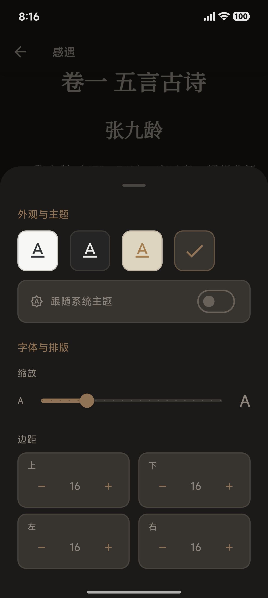

[简体中文](./README_zh-CN.md) | **English**

# Lumina

<p align="center">
  
</p>

A lightweight EPUB e-book reader built with Flutter, supporting both Android and iOS platforms.

[](https://flutter.dev)
[](./LICENSE)
[]()

## 🚧 Early Development Stage

Please note that this project is currently in Alpha. Breaking changes to the database schema may occur without migration scripts in early versions.

## ✨ Key Features

- 📚 **EPUB Reading** - Supports EPUB 2.0/3.0 formats with smooth page turning, automatic reading progress saving, and complete EPUB rendering based on WebView
- 🗂️ **Bookshelf Management** - Custom grouping, multi-dimensional sorting, and batch operations
- 🎨 **Elegant Interface** - Light/dark theme switching for comfortable reading experience
- ⚡ **Efficient Architecture** - Streaming loading of EPUB compressed files for fast startup

## 📱 Screenshots

<table>
  <tr>
    <td align="center">
      
      <br />
      <sub>Shelf</sub>
    </td>
    <td align="center">
      
      <br />
      <sub>About</sub>
    </td>
    <td align="center">
      
      <br />
      <sub>Reader</sub>
    </td>
    <td align="center">
      
      <br />
      <sub>Book Details</sub>
    </td>
  </tr>
  <tr>
    <td align="center">
      
      <br />
      <sub>Table of Contents</sub>
    </td>
    <td align="center">
      
      <br />
      <sub>Style Settings</sub>
    </td>
    <td align="center">
      
      <br />
      <sub>Footnote Support</sub>
    </td>
    <td align="center">
      
      <br />
      <sub>Vertical Reading Support</sub>
    </td>
  </tr>
</table>

## 🚀 Quick Start

Visit the [Releases page](https://github.com/MilkFeng/lumina/releases) to download the latest version.

- **Android Users**: Download the `.apk` file and install it directly.
- **iOS Users**: Download the `.ipa` file and install it via **sideloading**.
    - **Recommended Tools**: [AltStore](https://altstore.io/) (Recommended), [Sideloadly](https://sideloadly.io/), or [TrollStore](https://github.com/opa334/TrollStore) (for supported iOS versions).
    - *Note: If using a free Apple ID, you will typically need to refresh the app signature every 7 days.*

## 🔧 Developer Guide

### Requirements
- Flutter SDK ≥ 3.10.8
- Dart SDK ≥ 3.10.8
- iOS 12.0+ / Android 5.0+ (API Level 21+)

### Build from Source

1. **Clone the Repository**
```bash
git clone https://github.com/MilkFeng/lumina.git
cd lumina
```

2. **Install Dependencies**
```bash
flutter pub get
```

3. **Run the App**

```bash
flutter run
```

Or specify a device:
```bash
flutter run -d <device-id>
```

### Build Release Version

**Android APK**
```bash
flutter build apk --release
```

**iOS**
```bash
flutter build ios --release
```

## 🗺️ Roadmap

- [x] Basic EPUB parsing and rendering
- [x] Stream-from-Zip streaming loading
- [x] Smooth page turning animations
- [x] Automatic reading progress saving
- [x] Bookshelf grouping management
- [x] Table of contents navigation
- [x] Adaptive light/dark themes
- [x] Internationalization support (Chinese/English)
- [x] Avoid duplicate page turns when two NCX navigation points are on the same page
- [x] Long press images to view full-size
- [x] Simple swipe page turning mode
- [x] Improve screenshot speed during page turns on iOS
- [x] Import folders
- [x] Optimize initial loading lag when opening the first book
- [x] Export library
- [x] Test import/export functionality on iOS
- [x] Bookshelf homepage can switch between "Compact, Comfortable" layout modes, and can set whether to show book reading progress bars
- [x] Vertical and RTL support
- [x] Associate with epub format for direct opening of epub files
- [x] Edit book metadata (title, author, etc.)
- [x] Reading settings (font size, background color, etc.)
- [x] Footnote support
- [x] Link handling
- [ ] Better color rendering
- [ ] Cloud sync (WebDAV)
- [ ] Search functionality
- [ ] Annotation and bookmarking features
- [ ] Edit book covers
- [ ] More reading settings options
- [ ] Chinese support for error messages

## 🙏 Acknowledgements

This project uses the following excellent open-source projects:

- [Flutter](https://flutter.dev) - Google's UI toolkit
- [Riverpod](https://riverpod.dev) - Reactive state management
- [Isar](https://isar.dev) - High-performance NoSQL database

Thanks to all contributors for their support!

---

**⭐ If this project helps you, feel free to star it!**

Issues and pull requests are welcome
