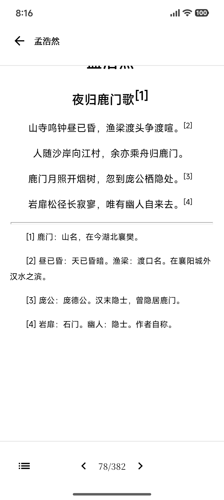
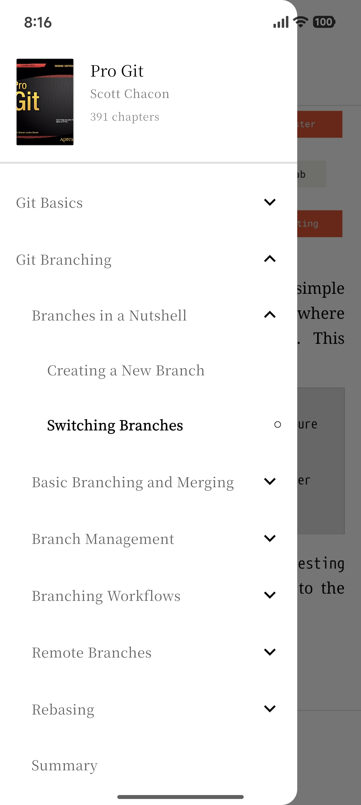
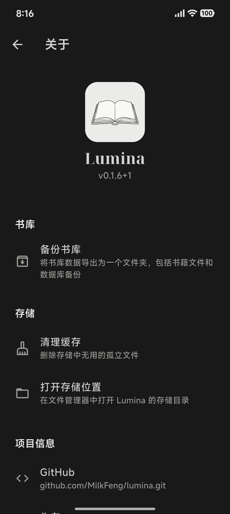

**简体中文** | [English](./README.md)

# Lumina

[](https://flutter.dev)
[](./LICENSE)
[]()

> 一个基于 Flutter 开发的轻量级 EPUB 电子书阅读器，支持 Android 和 iOS 双平台。

## 🚧 早期开发阶段

请注意，本项目目前处于 Alpha 测试阶段。早期版本中，数据库架构可能会发生重大变更，且未提供迁移脚本。

## ✨ 核心功能

- 📚 **EPUB 阅读** - 支持 EPUB 2.0/3.0 格式，流畅翻页，自动保存阅读进度，基于 WebView 的完整的 Epub 渲染
- 🗂️ **书架管理** - 自定义分组、多维度排序、批量操作
- 🎨 **优雅界面** - 亮暗主题切换，内置思源宋体，舒适阅读体验
- ⚡ **高效架构** - 流式加载 Epub 压缩文件，快速启动

## 📱 截图预览

<table>
  <tr>
    <td align="center">
      
      <br />
      <sub>书架页面</sub>
    </td>
    <td align="center">
      
      <br />
      <sub>深色模式</sub>
    </td>
    <td align="center">
      
      <br />
      <sub>中文</sub>
    </td>
  </tr>
  <tr>
    <td align="center">
      
      <br />
      <sub>目录导航</sub>
    </td>
    <td align="center">
      
      <br />
      <sub>关于</sub>
    </td>
  </tr>
</table>

## 🚀 快速开始

前往 [Releases 页面](https://github.com/MilkFeng/lumina/releases) 下载最新版本。

- **Android 用户**：下载 `.apk` 文件直接安装。
- **iOS 用户**：下载 `.ipa` 文件，并使用 **侧载工具** 进行安装。
    - **推荐工具**：[AltStore](https://altstore.io/) (推荐)、[Sideloadly](https://sideloadly.io/) 或 [TrollStore](https://github.com/opa334/TrollStore) (仅限特定系统版本)。
    - *注意：使用免费 Apple ID 进行侧载时，通常每 7 天需要刷新一次签名。*

## 🔧 开发者指南

### 环境要求
- Flutter SDK ≥ 3.10.8
- Dart SDK ≥ 3.10.8
- iOS 12.0+ / Android 5.0+ (API Level 21+)

### 从源码构建

1. **克隆项目**
```bash
git clone https://github.com/MilkFeng/lumina.git
cd lumina
```

2. **安装依赖**
```bash
flutter pub get
```

3. **字体子集化（可选）**

如果需要优化字体文件大小，可以运行字体子集化脚本：

```bash
cd scripts
python generate_subsets.py
```

> 注意：需要安装 Python 3 和 fonttools 库（`pip install fonttools brotli`）

项目默认使用思源宋体（Source Han Serif）字体。如需使用其他字体，请修改 `./scripts/generate_subsets.py` 代码以进行子集化处理。

4. **运行应用**

```bash
flutter run
```

或指定设备：
```bash
flutter run -d <device-id>
```

### 构建发布版本

**Android APK**
```bash
flutter build apk --release
```

**iOS**
```bash
flutter build ios --release
```

## ⚠️ 注意事项

### 自定义字体许可
本项目内置了「思源宋体」（Source Han Serif）字体，遵循 [SIL Open Font License 1.1](./assets/fonts/LICENSE.txt)。

### EPUB 格式支持
- 支持标准 EPUB 2.0 和 EPUB 3.0 格式
- 暂不支持 DRM 加密的电子书
- 推荐使用符合标准的 EPUB 文件以获得最佳体验

## 🗺️ 开发计划

- [x] 基础 EPUB 解析与渲染
- [x] Stream-from-Zip 流式加载
- [x] 流畅的翻页动画
- [x] 阅读进度自动保存
- [ ] 云端同步 (WebDAV)
- [x] 书架分组管理
- [x] 目录导航
- [x] 自适应亮暗主题
- [x] 国际化支持（中英文）
- [x] 两个 NCX 导航点处于同一页时不进行重复的翻页
- [x] 长按图片查看大图
- [x] 简单的滑动翻页模式
- [x] 解决 iOS 下翻页时截图速度较慢的问题
- [ ] 解决 iOS 和 Android 下翻页动画的一致性问题
- [ ] 优化打开第一本书时的卡顿
- [ ] 编辑书籍的元数据（封面、标题、作者等）
- [ ] 阅读设置（字体大小、行距、背景颜色等）

## 🙏 致谢

本项目使用了以下优秀的开源项目：

- [Flutter](https://flutter.dev) - Google 的 UI 工具包
- [Riverpod](https://riverpod.dev) - 响应式状态管理
- [Isar](https://isar.dev) - 高性能 NoSQL 数据库
- [Source Han Serif](https://github.com/adobe-fonts/source-han-serif) - Adobe 开源字体

感谢所有贡献者的支持！

---

**⭐ 如果这个项目对你有帮助，欢迎点亮 Star！**

如有问题或建议，欢迎提出 issue 或 pull request