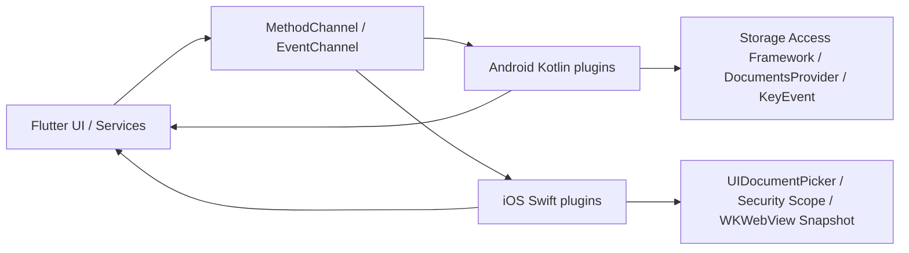

# 多平台原生层架构说明

本文档总结 Android `android/app/src/main/kotlin/com/lumina/epub_ereader` 和 iOS `ios/Runner` 中的原生代码职责，重点说明跨平台功能、Flutter 关系、MethodChannel/EventChannel 接口和维护边界。

## 总览

Lumina 的业务主体在 Flutter。Android Kotlin 与 iOS Swift 代码只承接 Flutter 无法直接稳定完成的系统能力：

- 文件和目录选择：EPUB、备份目录、字体文件、书籍封面图片。
- iOS 安全域文件按需复制。
- Android 音量键翻页拦截。
- iOS 原生 WKWebView 翻页快照动画。
- Android DocumentsProvider 暴露应用私有存储。
- Android/iOS 注册为 EPUB 文档处理应用。

整体调用关系：



## 原生目录职责

| 路径 | 职责 |
| --- | --- |
| `android/app/src/main/kotlin/com/lumina/epub_ereader/MainActivity.kt` | Android Flutter entry activity，注册自定义插件并转发音量键事件。 |
| `android/app/src/main/kotlin/com/lumina/epub_ereader/NativePickerPlugin.kt` | Android SAF 文件/目录选择插件。 |
| `android/app/src/main/kotlin/com/lumina/epub_ereader/VolumeControlPlugin.kt` | Android 音量键拦截插件。 |
| `android/app/src/main/kotlin/com/lumina/epub_ereader/LuminaDocumentsProvider.kt` | Android DocumentsProvider，向系统文件管理器暴露应用私有存储。 |
| `ios/Runner/AppDelegate.swift` | iOS Flutter app delegate，注册 generated plugins 和自定义 Swift 插件。 |
| `ios/Runner/NativePickerPlugin.swift` | iOS 文件/目录选择、security-scoped resource 生命周期和按需复制。 |
| `ios/Runner/ReaderPageTurnPlugin.swift` | iOS WKWebView 快照翻页动画插件。 |
| `ios/Runner/Info.plist` | iOS 文档类型、文件共享、ATS、方向等系统声明。 |
| `ios/Runner/Runner-Bridging-Header.h` | Swift/ObjC bridge，导入 generated plugin registrar。 |
| `ios/Runner/Base.lproj/*`、`Assets.xcassets/*` | 标准启动页、主 storyboard 和图标/启动图资源。 |

## Flutter 侧封装

原生接口不直接散落在业务 UI 中，而是由 Flutter 服务封装：

| Flutter 文件 | 对应原生能力 |
| --- | --- |
| `lib/src/core/platform/file_picker_service.dart` | 平台文件/目录选择与读取入口，调用 `com.lumina.ereader/native_picker`。只负责取得句柄与读取字节，不理解 EPUB/备份/字体等业务。 |
| `lib/src/core/platform/platform_path.dart` | 用 `AndroidUriPath` 和 `IOSFilePath` 抽象平台路径。 |
| `lib/src/core/platform/import_cache_manager.dart` | 将 Android SAF URI 或 iOS security-scoped 文件缓存到 app 内部。 |
| `lib/src/features/library/data/services/import_file_pipeline.dart` | 组合 picker 与 cache：读取文本/字节、缓存文件、计算 SHA-256。 |
| `lib/src/features/library/data/services/backup_folder_resolver.dart` | 解析备份包目录结构（`shelf.json`/`books`/`manifests`/`covers`），是唯一理解备份布局的地方。 |
| `lib/src/features/reader/data/services/volume_control_service.dart` | Android 音量键 MethodChannel/EventChannel 封装。 |
| `lib/src/features/reader/presentation/page_turn/ios_page_turn_session.dart` | iOS 原生翻页动画 MethodChannel 封装。 |
| `lib/src/features/reader/presentation/page_turn/android_page_turn_session.dart` | Android 翻页动画纯 Dart 实现，不走原生插件。 |
| `lib/src/features/settings/presentation/settings_screen.dart` | Android 打开 DocumentsProvider 暴露的 Lumina Books 根目录。 |

### 详情页封面编辑

`FilePickerService.pickImageFile()` 通过同名 MethodChannel 方法单选图片：Android 使用 `ACTION_OPEN_DOCUMENT` 和 `image/*`，iOS 使用图片 UTType，返回零或一个平台文件句柄。取消返回空列表；读取结束后释放 iOS 安全域。

`BookCoverEditService` 复用 `ImportWorkers.compressImage` 转换图片，与导入封面共用 JPEG 格式、质量 85 和 `minWidth/minHeight = 800` 的缩放参数，并以 JPG 草稿保存在 `import_cache`；转换失败时不使用原图回退。编辑页仅预览草稿；放弃或离开时删除草稿。确认保存后写入 `covers/{fileHash}.jpg`，数据库保存失败时恢复原文件和原路径，保留草稿用于重试。新草稿完成预解码后才替换当前预览；保存成功后沿用同一个内存图片显示详情，避免文件重新读取和淡入造成空白。书架文件图片缓存仍会刷新，并清理旧封面。

## 原生插件注册

### Android

`MainActivity` 继承 `FlutterFragmentActivity`：

```kotlin
class MainActivity : FlutterFragmentActivity() {
    private val volumeControlPlugin = VolumeControlPlugin()

    override fun configureFlutterEngine(flutterEngine: FlutterEngine) {
        super.configureFlutterEngine(flutterEngine)
        flutterEngine.plugins.add(NativePickerPlugin())
        flutterEngine.plugins.add(volumeControlPlugin)
    }
}
```

Android 自定义插件通过 `configureFlutterEngine` 手工加入 engine：

- `NativePickerPlugin`
- `VolumeControlPlugin`

`MainActivity.onKeyDown` 会先让 `VolumeControlPlugin.processKeyDown(...)` 判断是否消费音量键；未消费才交给系统默认逻辑。

### iOS

`AppDelegate` 继承 `FlutterAppDelegate` 并实现 `FlutterImplicitEngineDelegate`：

```swift
func didInitializeImplicitFlutterEngine(_ engineBridge: any FlutterImplicitEngineBridge) {
  GeneratedPluginRegistrant.register(with: engineBridge.pluginRegistry)
  NativePickerPlugin.register(with: registrar)
  ReaderPageTurnPlugin.register(with: registrar)
}
```

iOS 在 implicit Flutter engine 初始化后注册：

- Flutter generated plugins。
- 自定义 `NativePickerPlugin`。
- 自定义 `ReaderPageTurnPlugin`。

## Channel 接口总表

| Channel | 类型 | 平台 | 方法/事件 | 说明 |
| --- | --- | --- | --- | --- |
| `com.lumina.ereader/native_picker` | MethodChannel | Android/iOS | `pickEpubFiles` | 选择多个 EPUB。 |
| `com.lumina.ereader/native_picker` | MethodChannel | Android/iOS | `pickEpubFolder` | 选择目录并扫描 EPUB。 |
| `com.lumina.ereader/native_picker` | MethodChannel | Android/iOS | `pickBackupFolder` | 选择备份目录并返回可用文件列表。 |
| `com.lumina.ereader/native_picker` | MethodChannel | Android/iOS | `pickFontFiles` | 选择字体文件。 |
| `com.lumina.ereader/native_picker` | MethodChannel | Android/iOS | `getDisplayNames` | 批量解析 `content://` URI / 路径的显示名（文件名）。 |
| `com.lumina.ereader/native_picker` | MethodChannel | iOS | `fetchIosFile` | 在安全域仍有效时复制单个文件到临时目录。 |
| `com.lumina.ereader/native_picker` | MethodChannel | iOS | `releaseIosAccess` | 释放 iOS security-scoped resource。 |
| `lumina/volume_control` | MethodChannel | Android | `enableInterception` | 开启音量键拦截。 |
| `lumina/volume_control` | MethodChannel | Android | `disableInterception` | 关闭音量键拦截。 |
| `lumina/volume_events` | EventChannel | Android | `"up"` / `"down"` | 音量键事件流。 |
| `lumina/reader_page_turn` | MethodChannel | iOS | `preparePageTurn` | 截取当前 WKWebView 快照。 |
| `lumina/reader_page_turn` | MethodChannel | iOS | `animatePageTurn` | 用快照执行翻页滑动动画。 |

## 文件导入与选择

### Flutter 分层

平台能力与业务编排分成两层，`core` 不理解书籍、备份或字体：

**`core/platform/FilePickerService`** —— 只负责取得句柄与读取字节：

- `pickEpubFiles()`
- `pickEpubFolder()`
- `pickFolderFiles()`（返回目录下全部文件，不做任何业务过滤）
- `pickFontFiles()`
- `resolveDisplayNames(List<PlatformPath>)` —— 向平台查询真实文件名（见 [字体导入处理](#字体导入处理)）
- `readBytes(PlatformPath)` / `readPlainFile(PlatformPath)`
- `releaseIosAccess()`

返回路径统一包装成：

- Android：`AndroidUriPath(contentUri)`
- iOS：`IOSFilePath(fileSystemPath)`

`PlatformPath` 只是不透明的平台句柄：`AndroidUriPath.name` 由 SAF document id 推导，只在 URI 形态标准时才是真实文件名（Downloads provider 返回的是 `msf:1000000123` 这类 id），因此需要真实文件名时必须调用 `resolveDisplayNames()`，不要解析 URI。

**`features/library/data/services/ImportFilePipeline`** —— 组合 picker 与缓存：

- `readText()` / `readBytes()` / `cacheFile()` / `cacheFileWithHash()` / `cleanCache()` / `clearCache()` / `releaseIosAccess()`

缓存写入由 `core/platform/ImportCacheManager` 接管：

- Android 使用 `saf_stream` 从 `content://` URI 流式读取到 import cache。
- iOS 通过 Swift `fetchIosFile` 先复制到临时目录，再由 Dart rename/copy 到 import cache。
- 缓存文件保留原始扩展名。
- EPUB 的 SHA-256 去重 hash 由 `ImportFilePipeline.cacheFileWithHash()` 计算。
- 字体不计算 hash，只复制进 fonts 目录。

备份包的目录识别不属于平台层，见 [备份目录处理](#备份目录处理)。

### Android NativePickerPlugin

Android 插件实现 `FlutterPlugin`、`MethodCallHandler`、`ActivityAware`。它需要 Activity 才能启动系统 picker，因此在 `onAttachedToActivity` 中注册多个 `ActivityResultLauncher`：

- `pickFilesLauncher`
- `pickFolderLauncher`
- `pickBackupFolderLauncher`
- `pickFontFilesLauncher`

并用单个 `pendingResult` 防止同时启动多个 picker。如果已有 picker 未完成，再次调用会返回：

```text
ALREADY_ACTIVE
```

方法行为：

| 方法 | Android intent | 返回 |
| --- | --- | --- |
| `pickEpubFiles` | `ACTION_OPEN_DOCUMENT`，`application/epub+zip`，允许多选 | EPUB `content://` URI 字符串列表。 |
| `pickEpubFolder` | `ACTION_OPEN_DOCUMENT_TREE`，持久读权限 | 递归扫描出的 EPUB `content://` URI 列表。 |
| `pickBackupFolder` | `ACTION_OPEN_DOCUMENT_TREE`，读权限 | 递归扫描出的所有文件 URI 列表。 |
| `pickFontFiles` | `ACTION_OPEN_DOCUMENT`，字体 MIME，允许多选 | `.ttf` / `.otf` 字体 URI 列表。 |
| `getDisplayNames` | 不启动 picker | 逐个 URI 查询 `COLUMN_DISPLAY_NAME`，返回与入参等长的名字列表；查不到的位置是 `null`。 |

重工作都放到 `Dispatchers.IO`：

- 查询文件显示名和 MIME。
- 递归遍历 `DocumentFile` 目录树。
- 过滤 EPUB 或字体。

Android EPUB 判断：

- 文件名以 `.epub` 结尾。
- 或 MIME 是 `application/epub+zip`。

Android 字体判断：

- 文件名以 `.ttf` / `.otf` 结尾。
- 或 MIME 是 `font/ttf`、`font/otf`、`application/x-font-ttf`、`application/x-font-otf`。

### iOS NativePickerPlugin

iOS 插件通过 `UIDocumentPickerViewController` 实现相同 channel。不同点是 iOS 文件选择存在 security-scoped resource 生命周期。

插件保留两类访问状态：

- `activeDirectoryUrl`：目录选择后保留整个目录的安全访问。
- `activeFileUrls`：多文件选择后保留每个文件的安全访问。

方法行为：

| 方法 | iOS picker | 返回 |
| --- | --- | --- |
| `pickEpubFiles` | `UIDocumentPickerViewController`，EPUB UTI，允许多选 | 文件系统 path 列表。 |
| `pickEpubFolder` | folder picker | 递归扫描出的 `.epub` path 列表。 |
| `pickBackupFolder` | folder picker | 扩展名为 `epub/json/jpg/jpeg/png/webp` 的 path 列表。 |
| `pickFontFiles` | TTF/OTF UTType，允许多选 | 字体 path 列表。 |
| `fetchIosFile` | 无 UI | 将 path 对应文件复制到 `NSTemporaryDirectory()`，返回临时 path。 |
| `releaseIosAccess` | 无 UI | stopAccessing 并清空保留 URL。 |

Flutter 必须在一次 pick + process 流程结束后调用 `releaseIosAccess()`。当前调用点包括：

- 字体导入的 `finally`。
- 备份导入的 `finally`。
- `FilePickerService.releaseIosAccess()` 对 Android 是 no-op。

## 备份目录处理

原生层只返回一个“扁平文件列表”。备份结构识别由 Flutter 完成。

`BackupFolderResolver` 是唯一理解备份布局的地方。它根据文件名和父目录名识别：

- `shelf.json`
- `books/{hash}.epub`
- `manifests/{hash}.json`
- `covers/{hash}.{ext}`

随后 `_buildBookPaths(...)` 只保留同时有 EPUB 和 manifest 的书籍；缺少 `shelf.json` 时抛 `FormatException`，调用方据此提示用户所选目录不是有效备份。`ImportBackupService.restoreLibrary(...)` 再逐本读取、复制、写入数据库记录。

`shelf.json` 顶层带有 `version` 字段，每个 `manifests/{hash}.json` 也带同一个版本号，两者都由 `BackupFormat.current` 写入（当前为 2）。恢复时以 `shelf.json` 的版本为准：缺少 `version` 字段、或版本高于当前构建支持的版本时直接报错拒绝恢复（返回 `ImportFailure`，此时本地书库尚未被清空），因为恢复是整库替换，接受一个读不懂的包会直接毁掉现有书库；版本更旧则照常恢复。

这个设计让三层各自保持薄：Android/iOS 原生层只获得平台可访问的文件句柄，`core/platform` 只读出字节，只有 library 的 data 层理解 Lumina 的备份格式。

## 字体导入处理

字体导入路径：


导入完成后，字体文件存放在：

```text
{AppStorage.documentsPath}/fonts/{fileName}
```

阅读器 WebView 通过 `epub://localhost/fonts/{fileName}` 读取这些字体。因为文件名会被写进 `@font-face` 的 URL，`FontManagerNotifier` 会把它清洗成一个安全的纯文件名（去掉路径分隔符，`#`、`?`、`%`、引号等替换为 `_`），并保证带字体扩展名。

文件名来源按优先级：

1. `resolveDisplayNames()` 返回的平台显示名 —— 唯一可靠的名字来源。
2. `PlatformPath.name` —— 由 URI 推导，只在 URI 形态标准时正确。
3. 形如 `font_{microseconds}.ttf` 的生成名。

第 3 步不能用固定占位名：文件名就是字体在列表里的身份，所有导入共用一个占位名会被去重逻辑当成同一个字体，后导入的字体会覆盖前一个（历史 bug：全部显示为 `unknown`）。

## Android 音量键翻页

Android 原生插件：

- MethodChannel：`lumina/volume_control`
- EventChannel：`lumina/volume_events`

Flutter 侧 `VolumeControlService` 只在 Android 工作，其他平台直接 no-op。

流程：

1. 阅读页进入或生命周期恢复时，`ReaderScreen.setupVolumeControl()` 判断设置项 `volumeKeyTurnsPage`、抽屉状态、生命周期状态。
2. 满足条件时调用 `enableInterception`。
3. `MainActivity.onKeyDown` 把 key event 交给 `VolumeControlPlugin.processKeyDown`。
4. 如果正在拦截：
   - `KEYCODE_VOLUME_UP` 发送 `"up"`。
   - `KEYCODE_VOLUME_DOWN` 发送 `"down"`。
   - 返回 `true` 消费事件，系统音量不变化。
5. Flutter 监听事件：
   - `"up"` 触发上一页。
   - `"down"` 触发下一页。
   - 如果脚注浮层打开，则先关闭脚注浮层。
6. 离开阅读页或条件不满足时调用 `disableInterception`。

## 翻页动画

### Android

Android 没有原生翻页插件。`AndroidPageTurnSession` 在 Flutter 内完成：

- 调用 `ReaderWebViewController.takeScreenshot()` 获取 WebView 截图。
- 用 Flutter `AnimationController` 和 `SlideTransition` 滑动截图或 WebView。
- 页面切换和动画并行执行。

### iOS

iOS 使用原生 `ReaderPageTurnPlugin`，原因是 `WKWebView` 与 Flutter 截图/组合层在 iOS 上更适合由 UIKit 直接处理。

MethodChannel：`lumina/reader_page_turn`

`preparePageTurn`：

- 查找当前 active window。
- 递归查找最上层 `WKWebView`。
- 调用 `snapshotView(afterScreenUpdates: false)` 截取旧页面。
- 把 snapshot 加到 WKWebView superview 上方。

`animatePageTurn` 参数：

```dart
{
  'isNext': bool,
  'isVertical': bool,
}
```

动画行为：

- 下一页：旧 snapshot 滑出，新内容已在下方。
- 上一页：新 WKWebView 内容从侧边滑入，旧 snapshot 留在下方。
- 使用 `UIViewPropertyAnimator`，时长 0.25s。
- 根据深浅色模式设置阴影透明度。
- 用 `animationToken` 防止过期动画清理当前动画状态。

Flutter 侧 `IOSPageTurnSession.perform(...)` 的顺序是：

1. `preparePageTurn`
2. 执行真正的 Flutter/WebView 翻页逻辑
3. 异步 `animatePageTurn`

## Android DocumentsProvider

`LuminaDocumentsProvider` 让系统文件管理器能访问 Lumina 的应用私有文件。Manifest 中注册：

```xml
<provider
    android:name=".LuminaDocumentsProvider"
    android:authorities="${applicationId}.documents"
    android:exported="true"
    android:grantUriPermissions="true"
    android:permission="android.permission.MANAGE_DOCUMENTS">
    <intent-filter>
        <action android:name="android.content.action.DOCUMENTS_PROVIDER" />
    </intent-filter>
</provider>
```

provider 根目录是：

```text
{context.filesDir.parentFile}/app_flutter
```

对外 root：

```text
rootId = lumina_books_root
title = Lumina Books
summary = Library & Covers
```

根目录下只展示三个目录：

- `books`
- `covers`
- `fonts`

其他层级会展示所有子文件。文件只读打开：

```kotlin
ParcelFileDescriptor.open(file, ParcelFileDescriptor.MODE_READ_ONLY)
```

安全措施：

- `getFileForDocId` 会用 canonical path 检查目标仍在 base directory 内，防止 `../` 路径穿越。
- 不存在的文件抛 `FileNotFoundException`。

Flutter 设置页通过 Android intent 打开这个 root：

```text
content://{applicationId}.documents/root/lumina_books_root
type = vnd.android.document/root
```

iOS 没有对应 provider。它通过 `UIFileSharingEnabled` 暴露 Documents，并在设置页展示说明弹窗。

## 文档打开与系统集成

### Android Manifest

Android 注册了：

- `ACTION_VIEW` + `application/epub+zip`
- `ACTION_VIEW` + `file/content` scheme + `.epub` path pattern + `*/*`
- `ACTION_SEND` + `application/epub+zip`

同时设置：

- `android:launchMode="singleTop"`
- `android:usesCleartextTraffic="true"`
- 读存储和 Android 13 媒体权限声明。

当前 Kotlin 目录中没有自定义 `onNewIntent` 或 intent 数据转发逻辑；这些 intent filter 声明让系统可以把 EPUB 打开请求路由到应用，但实际“接收外部 EPUB 并导入”的业务链路需要 Flutter 或额外原生代码消费 intent 数据。

### iOS Info.plist

iOS 声明：

- `CFBundleDocumentTypes`：作为 `org.idpf.epub-container` 的 Viewer。
- `UTImportedTypeDeclarations`：声明 EPUB UTI，扩展名 `.epub`，MIME `application/epub+zip`。
- `LSSupportsOpeningDocumentsInPlace = true`
- `UIFileSharingEnabled = true`
- `NSAppTransportSecurity.NSAllowsArbitraryLoads = true`

当前 `AppDelegate` 没有实现 `application(_:open:options:)` 或 scene open URL handoff；Info.plist 负责系统可见能力声明，外部打开 EPUB 后如何进入 Flutter 导入流程需要单独检查/实现。

## Android 构建配置关系

`android/app/build.gradle.kts` 中：

- namespace/applicationId：`com.lumina.ereader`
- compile/target SDK：36
- Java/Kotlin target：17
- release 开启 minify 和 resource shrink。

为原生功能添加的依赖：

| 依赖 | 用途 |
| --- | --- |
| `androidx.activity:activity-ktx` | `ActivityResultRegistryOwner` / Activity result launcher。 |
| `androidx.fragment:fragment-ktx` | Fragment/activity 相关 Kotlin 扩展。 |
| `kotlinx-coroutines-android` | 在生命周期 scope 中异步处理 picker 结果。 |
| `kotlinx-coroutines-core` | coroutine 基础能力。 |
| `androidx.documentfile:documentfile` | SAF tree 递归遍历。 |

## 平台差异总结

| 能力 | Android | iOS |
| --- | --- | --- |
| 多文件选择 | SAF `ACTION_OPEN_DOCUMENT`，返回 `content://` URI | `UIDocumentPickerViewController`，返回 file path 并保留 security scope |
| 目录扫描 EPUB | SAF tree + `DocumentFile` BFS | `FileManager.enumerator` |
| 备份目录扫描 | 返回所有文件 URI | 返回白名单扩展名文件 path |
| 字体选择 | MIME + 扩展名过滤 | UTType TTF/OTF |
| 文件读取 | Dart 用 `saf_stream` 流式读 `content://` | Swift 先复制到 temp，Dart 再读 temp |
| 访问释放 | Android 持久 URI 权限或一次性 URI 权限，无 release channel | 必须调用 `releaseIosAccess` |
| 翻页动画 | Flutter 截图 + Flutter 动画 | UIKit 截取 WKWebView snapshot + native 动画 |
| 音量键翻页 | 原生 KeyEvent + EventChannel | 无 |
| 存储位置展示 | DocumentsProvider + Android intent 打开 root | `UIFileSharingEnabled` + Flutter 弹窗提示 |

## 维护注意事项

- `com.lumina.ereader/native_picker` 是跨平台文件选择的稳定 channel；新增方法时需要同时评估 Android、iOS 和 `FilePickerService`。
- Android picker 当前只允许一个 pending operation；Flutter 不应并发调用多个 picker 方法。
- iOS pick 后必须在 `finally` 中调用 `releaseIosAccess()`，否则 security-scoped resource 可能泄漏。
- Android `DocumentsProvider` 对外只读；如果未来要支持外部写入或删除，需要新增 flags 和实现对应 provider 方法。
- `LuminaDocumentsProvider` 的 docId 是相对路径，必须保留 canonical path 防穿越检查。
- Android 音量键拦截只在阅读页启用，离开页面和生命周期变化时要关闭，避免影响系统音量控制。
- iOS 翻页插件通过递归查找 topmost `WKWebView`，如果阅读页 WebView 层级变化，需要验证它仍找到正确视图。
- Android/iOS 都声明了 EPUB 文档处理能力，但当前 inspected native code 没有把外部打开 intent/document URL 显式传给 Flutter 导入流程；新增该能力时应设计单独 channel 或启动参数处理。
- 原生插件名称、channel 字符串和 Flutter service 中的字符串必须保持一致。
