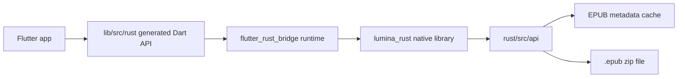

# Rust 与 rust_builder 架构说明

本文档总结 `rust` 和 `rust_builder` 两个目录的职责、运行时调用链、构建链路、对 Dart 暴露的接口，以及后续维护注意事项。

## 总览

`rust` 是实际业务 Rust crate，包名是 `lumina_rust`。它通过 `flutter_rust_bridge` 暴露给 Flutter，当前核心用途是让阅读器直接从压缩 EPUB 中按需读取单个文件，避免预解压整本书。

`rust_builder` 是 Flutter FFI plugin 壳。它自身几乎没有业务代码，只负责把 `rust/Cargo.toml` 指向的 crate 编译进 Android、iOS、macOS、Linux、Windows 构建产物。实际平台构建由 vendored `rust_builder/cargokit` 完成。

运行时关系：



构建关系：


## 目录职责

| 路径 | 职责 |
| --- | --- |
| `flutter_rust_bridge.yaml` | FRB 代码生成配置，指定 Rust 输入和 Dart 输出。 |
| `rust/Cargo.toml` | Rust crate 配置、crate 类型、依赖、release 优化。 |
| `rust/Cargo.lock` | Rust 依赖锁定。 |
| `rust/about.toml` | `cargo-about` 许可白名单配置。 |
| `rust/about.hbs` | Rust license JSON 模板，产物用于 `assets/licenses/rust_licenses.json`。 |
| `rust/src/lib.rs` | Rust crate 入口，引入 generated bridge 和业务 API。 |
| `rust/src/frb_generated.rs` | `flutter_rust_bridge_codegen` 生成的 Rust wire 层，不应手改。 |
| `rust/src/api/mod.rs` | Rust API 模块索引。 |
| `rust/src/api/simple.rs` | FRB 初始化函数和 `greet` 示例函数。 |
| `rust/src/api/epub.rs` | EPUB 按需读取后端，是当前主要业务逻辑。 |
| `rust_builder/pubspec.yaml` | Flutter FFI plugin 声明，作为主 app 的 path dependency。 |
| `rust_builder/android/*` | Android plugin 配置，通过 Gradle 接入 cargokit。 |
| `rust_builder/ios/*` | iOS podspec，通过 script phase 编译 Rust 静态库。 |
| `rust_builder/macos/*` | macOS podspec，通过 script phase 编译 Rust 静态库。 |
| `rust_builder/linux/CMakeLists.txt` | Linux CMake 接入 cargokit。 |
| `rust_builder/windows/CMakeLists.txt` | Windows CMake 接入 cargokit。 |
| `rust_builder/cargokit/*` | vendored cargokit，用 Dart build_tool 驱动 rustup/cargo 并复制产物。 |
| `lib/src/rust/*` | FRB 生成的 Dart API 和 wire 层，虽然不在本次目录内，但它是 `rust` 的 Dart 侧镜像。 |

## Rust crate 配置

`rust/Cargo.toml`：

```toml
[package]
name = "lumina_rust"
edition = "2021"

[lib]
crate-type = ["cdylib", "staticlib"]
```

`cdylib` 用于 Android、Linux、Windows 等动态库场景；`staticlib` 用于 iOS/macOS CocoaPods 静态链接场景。

主要依赖：

| 依赖 | 用途 |
| --- | --- |
| `flutter_rust_bridge = "=2.11.1"` | Dart/Rust FFI bridge runtime。 |
| `once_cell` | 初始化全局 EPUB cache。 |
| `parking_lot` | 更轻量的 `RwLock`。 |
| `rc-zip` with `deflate` | ZIP/EPUB central directory 解析和条目解压。 |
| `positioned-io` | `ReadAt` 定位读取 ZIP central directory，不移动文件指针。 |

release profile 做了尺寸优化：

```toml
opt-level = 'z'
lto = true
codegen-units = 1
strip = true
```

## flutter_rust_bridge 生成关系

配置文件：

```yaml
rust_input: crate::api
rust_root: rust/
dart_output: lib/src/rust
```

含义：

- 只从 `rust/src/api` 下的公开函数生成 Dart API。
- Rust 根目录是 `rust/`。
- Dart 侧生成到 `lib/src/rust`。

生成文件包括：

| 文件 | 说明 |
| --- | --- |
| `rust/src/frb_generated.rs` | Rust 侧 wire function、codec、dispatcher、IO/Web boilerplate。 |
| `lib/src/rust/frb_generated.dart` | Dart 侧入口 `RustLib`、API implementation 和 codec。 |
| `lib/src/rust/frb_generated.io.dart` | IO 平台动态库加载 glue。 |
| `lib/src/rust/frb_generated.web.dart` | Web/WASM 侧 glue，目前项目主要使用 IO 平台。 |
| `lib/src/rust/api/*.dart` | 对应 Rust API 的 Dart facade。 |

当前生成版本为 `flutter_rust_bridge` 2.11.1。主 app `pubspec.yaml` 中声明的是 `flutter_rust_bridge: 2.12.0`，而 Rust `Cargo.toml` 和生成文件是 2.11.1；升级 FRB 时需要同步 Rust 依赖、Dart 依赖和 generated 文件。

## 运行时初始化

`lib/main.dart` 在 app 启动时调用：

```dart
await RustLib.init();
```

`RustLib.init()` 会加载 native library，初始化 bridge，并执行 generated entrypoint 中的 Rust initializer：

```dart
await api.crateApiSimpleInitApp();
```

对应 Rust 函数：

```rust
#[flutter_rust_bridge::frb(init)]
pub fn init_app() {
    flutter_rust_bridge::setup_default_user_utils();
}
```

因此，任何 Rust API 调用前都必须先完成 `RustLib.init()`。

默认动态库加载配置在 `lib/src/rust/frb_generated.dart`：

```dart
ExternalLibraryLoaderConfig(
  stem: 'lumina_rust',
  ioDirectory: 'rust/target/release/',
  webPrefix: 'pkg/',
)
```

Flutter 平台构建时，`rust_builder` 会把对应平台的 native library 打进 app，不依赖运行时从源码目录找库。

## Rust 暴露接口

### `init_app()`

Rust initializer，由 FRB 在 `RustLib.init()` 时自动调用。

Dart 侧没有业务调用入口，生成层内部调用 `crateApiSimpleInitApp()`。

### `greet(name: String) -> String`

同步示例函数：

```rust
#[flutter_rust_bridge::frb(sync)]
pub fn greet(name: String) -> String
```

Dart facade：

```dart
String greet({required String name})
```

当前项目业务代码未使用它。

### `load_epub(epub_path: String) -> Result<(), String>`

Dart facade：

```dart
Future<void> loadEpub({required String epubPath})
```

职责：

- 打开指定 EPUB 文件。
- 只解析 ZIP central directory，不解压文件内容。
- 构建“标准化条目路径到 archive entry index”的 `HashMap`。
- 把解析结果缓存到全局 `EPUB_CACHE`。
- 对同一路径重复调用是幂等 no-op。

错误通过 `Result<(), String>` 返回给 Dart，Dart 侧会表现为 Future error。

### `read_epub_file(epub_path, file_path) -> Result<Option<Vec<u8>>, String>`

Dart facade：

```dart
Future<Uint8List?> readEpubFile({
  required String epubPath,
  required String filePath,
})
```

职责：

- 标准化 `file_path` 后查找条目。
- 如果 EPUB 未通过 `load_epub` 加载，返回错误。
- 如果条目不存在，返回 `Ok(None)`，Dart 侧为 `null`。
- 如果条目存在，打开新的文件句柄，从该条目的 local header 位置开始读取并解压。
- 解压结果返回 `Ok(Some(bytes))`，Dart 侧为 `Uint8List`。

安全和性能规则：

- 单个条目的未压缩大小上限是 50 MiB，超过会返回错误，避免 zip bomb。
- 媒体文件扩展名 `mp4/mp3/ogg/webm/wav/m4a/avi/mov` 会直接返回空字节 `Some(vec![])`，用于节省内存。
- 只在 clone `Arc<CachedArchive>` 时短暂持有全局读锁；实际 I/O 和解压不持锁。
- 每次读取都打开独立 `File` handle，因此多个 WebView 请求可以并发解压不同条目。
- `EntryFsm` 负责 local header、压缩数据、可选 data descriptor 和 CRC 校验。

### `close_epub(epub_path: String)`

Dart facade：

```dart
Future<void> closeEpub({required String epubPath})
```

职责：

- 从 `EPUB_CACHE` 移除对应 EPUB 的 central directory metadata。
- 阅读器关闭时调用，用于释放内存。

## EPUB 后端内部结构

`rust/src/api/epub.rs` 的核心数据结构：

```rust
struct CachedArchive {
    archive: Archive,
    index: HashMap<String, usize>,
}

static EPUB_CACHE: Lazy<RwLock<HashMap<String, Arc<CachedArchive>>>> = ...
```

`CachedArchive` 只保存 ZIP 元数据和条目索引，不保存解压后的文件内容。这样内存占用与 EPUB 文件数量和目录规模相关，不随阅读过的页面内容线性增长。

路径标准化规则：

- `\` 替换为 `/`。
- 移除所有开头的 `/`。
- 移除所有开头的 `./`。

这让 WebView 传入的 `OEBPS/chapter.xhtml`、`/OEBPS/chapter.xhtml`、`./OEBPS/chapter.xhtml` 可以命中同一个 EPUB entry。

读取流程：

1. `load_epub` 使用 `ArchiveFsm` 和 `ReadAt` 解析 central directory。
2. `read_epub_file` 从 cache clone `Arc<CachedArchive>`。
3. 通过 `index` O(1) 找到 entry index。
4. 从 `archive.entries().nth(entry_index)` 取 entry metadata。
5. 检查 `entry.uncompressed_size <= 50 MiB`。
6. 新开文件句柄，seek 到 `entry.header_offset`。
7. 使用 `EntryFsm` 逐步读压缩数据并写入预分配输出 buffer。
8. truncate 到实际写入长度并返回。

## Dart 侧使用链路

主要业务调用在 `lib/src/features/reader/data/services/epub_stream_service.dart`。

`EpubStreamService.openBook(epubPath)`：

- 避免重复打开当前书。
- 合并同一路径的并发 open 请求。
- 调用 `rust_epub.loadEpub(epubPath: epubPath)`。

`EpubStreamService.readFileFromEpub(...)`：

- 如传入的 `epubPath` 不是当前已加载路径，会先 `openBook`。
- 调用 `rust_epub.readEpubFile(...)`。
- `null` 转成 `left('File not found: ...')`。
- Rust error 转成 `left('Read error: ...')`。

`EpubStreamService.dispose()`：

- 异步调用 `rust_epub.closeEpub(...)`。
- 清空当前路径和 pending open 状态。

WebView 资源读取在 `EpubWebViewHandler` 中处理 `epub://localhost/book/{fileHash}/{filePath}` 一类虚拟 URL，最终走 `EpubStreamService.readFileFromEpub`，把 Rust 读出的字节和 MIME type 返回给 WebView。

## rust_builder 角色

主 app 在 `pubspec.yaml` 中依赖：

```yaml
lumina_rust:
  path: rust_builder
```

`rust_builder/pubspec.yaml` 声明自己是 FFI plugin：

```yaml
flutter:
  plugin:
    platforms:
      android:
        ffiPlugin: true
      ios:
        ffiPlugin: true
      linux:
        ffiPlugin: true
      macos:
        ffiPlugin: true
      windows:
        ffiPlugin: true
```

这让 Flutter 平台构建系统把该 plugin 纳入 native build。`rust_builder` 不提供 Dart 业务 API；Dart API 来自 `lib/src/rust` 的 FRB generated 文件。

## Android 构建链路

入口：`rust_builder/android/build.gradle`

关键配置：

```gradle
apply from: "../cargokit/gradle/plugin.gradle"
cargokit {
    manifestDir = "../../rust"
    libname = "lumina_rust"
}
```

流程：

1. Gradle plugin 找到 Flutter Android plugin。
2. 对每个 Android build variant 创建 `cargokitCargoBuildLumina_rust{BuildType}` task。
3. task 调用 `rust_builder/cargokit/run_build_tool.cmd` 或 `.sh`。
4. 环境变量传入 manifest、NDK、SDK、build mode、target platforms、output dir。
5. build_tool 执行 `build-gradle`。
6. `BuildGradle` 将 Flutter target platform 映射到 Rust target triple。
7. `ArtifactProvider` 优先尝试预编译产物；没有配置或不可用时本地 cargo build。
8. 生成的 `.so` 复制到 Gradle jniLibs 目录。
9. `merge{BuildType}NativeLibs` 依赖 cargokit task，确保 native library 打进 APK/AAB。

目标映射示例：

| Flutter target | Rust target | Android ABI |
| --- | --- | --- |
| `android-arm` | `armv7-linux-androideabi` | `armeabi-v7a` |
| `android-arm64` | `aarch64-linux-android` | `arm64-v8a` |
| `android-x86` | `i686-linux-android` | `x86` |
| `android-x64` | `x86_64-linux-android` | `x86_64` |

debug 构建会额外加入 `android-x86` 和 `android-x64`，方便模拟器运行。

## iOS 和 macOS 构建链路

入口：

- `rust_builder/ios/lumina_rust.podspec`
- `rust_builder/macos/lumina_rust.podspec`

两个 podspec 都通过 CocoaPods script phase 调用：

```sh
sh "$PODS_TARGET_SRCROOT/../cargokit/build_pod.sh" ../../rust lumina_rust
```

流程：

1. `build_pod.sh` 从 Xcode 环境读取 `PLATFORM_NAME`、`ARCHS`、`CONFIGURATION`。
2. 设置 `CARGOKIT_DARWIN_PLATFORM_NAME`、`CARGOKIT_DARWIN_ARCHS`、`CARGOKIT_MANIFEST_DIR` 等环境变量。
3. 调用 `run_build_tool.sh build-pod`。
4. `BuildPod` 将 Darwin platform 和 arch 映射到 Rust target。
5. 对每个 arch 编译 Rust static library。
6. 使用 `lipo -create` 合并为 `${BUILT_PRODUCTS_DIR}/liblumina_rust.a`。
7. podspec 通过 `OTHER_LDFLAGS = -force_load .../liblumina_rust.a` 强制链接静态库。

目标映射示例：

| Apple 平台 | 架构 | Rust target |
| --- | --- | --- |
| `iphoneos` | `arm64` | `aarch64-apple-ios` |
| `iphonesimulator` | `arm64` | `aarch64-apple-ios-sim` |
| `iphonesimulator` | `x86_64` | `x86_64-apple-ios` |
| `macosx` | `arm64` | `aarch64-apple-darwin` |
| `macosx` | `x86_64` | `x86_64-apple-darwin` |

## Linux 和 Windows 构建链路

入口：

- `rust_builder/linux/CMakeLists.txt`
- `rust_builder/windows/CMakeLists.txt`

Linux：

```cmake
apply_cargokit(${PROJECT_NAME} ../../rust lumina_rust "")
```

Windows：

```cmake
apply_cargokit(${PROJECT_NAME} ../../../../../../rust lumina_rust "")
```

路径不同是因为 Flutter Windows plugin 的 CMake working directory 层级更深。

`cargokit/cmake/cargokit.cmake` 做的事：

1. 解析 cargokit 根目录，Windows 下额外用 PowerShell 解析 symlink。
2. 设置 `CARGOKIT_MANIFEST_DIR`、`CARGOKIT_TARGET_TEMP_DIR`、`CARGOKIT_OUTPUT_DIR`、`CARGOKIT_TARGET_PLATFORM`。
3. 创建 CMake custom command 调用 `run_build_tool.{sh|cmd} build-cmake`。
4. 创建 `${target}_cargokit` custom target。
5. 把输出 library 暴露给 `${PROJECT_NAME}_cargokit_lib`，供 Flutter plugin bundled libraries 使用。

产物：

| 平台 | Rust target | 产物 |
| --- | --- | --- |
| Linux x64 | `x86_64-unknown-linux-gnu` | `liblumina_rust.so` |
| Linux arm64 | `aarch64-unknown-linux-gnu` | `liblumina_rust.so` |
| Windows x64 | `x86_64-pc-windows-msvc` | `lumina_rust.dll`、`lumina_rust.dll.lib`，debug/local build 可能还有 `.pdb` |

## cargokit build_tool

`rust_builder/cargokit/run_build_tool.sh` 和 `.cmd` 不直接编译 Rust。它们会在临时目录生成一个小 Dart runner package，依赖 vendored `cargokit/build_tool`，再编译并缓存 `build_tool_runner.dill`。这样可以避免污染 vendored cargokit 目录。

build_tool 支持的主要命令：

| 命令 | 调用方 | 作用 |
| --- | --- | --- |
| `build-gradle` | Android Gradle task | 构建并复制 Android `.so`。 |
| `build-pod` | iOS/macOS pod script phase | 构建并合并 Apple static library。 |
| `build-cmake` | Linux/Windows CMake custom command | 构建并复制 desktop dynamic library。 |
| `gen-key` | 手工维护 | 生成预编译二进制签名 key pair。 |
| `precompile-binaries` | 发布/CI 可选 | 构建并上传预编译二进制。 |
| `verify-binaries` | 发布/CI 可选 | 验证已发布预编译二进制签名。 |

本项目当前没有 `rust/cargokit.yaml`，因此没有启用 crate 级预编译二进制配置。`ArtifactProvider` 会直接走本地 `cargo build`。

## cargo build 策略

`RustBuilder.build()` 执行：

```text
rustup run {toolchain} cargo build
  --manifest-path {manifestDir}/Cargo.toml
  -p {packageName}
  [--release if not debug]
  --target {rustTarget}
  --target-dir {targetTempDir}
```

默认 toolchain 是 `stable`。如果 `rust/cargokit.yaml` 存在，可以按 build configuration 指定 toolchain 和 extra flags。

构建前准备：

- 如果 toolchain 未安装，调用 rustup 安装。
- 如果目标 Rust target 未安装，调用 rustup 安装。
- Android 会构造 NDK clang/linker 环境；如果 NDK 未安装且能拿到 Java home，会尝试安装对应 NDK。

build configuration 映射：

| Flutter/Xcode/Gradle mode | Rust profile |
| --- | --- |
| `debug` | cargo debug |
| `profile` | cargo release |
| `release` | cargo release |

## 许可文件

Rust license 相关文件：

- `rust/about.toml`
- `rust/about.hbs`
- `assets/licenses/rust_licenses.json`

`lib/main.dart` 会读取 `assets/licenses/rust_licenses.json` 并注册到 Flutter `LicenseRegistry`。新增 Rust 依赖后，应重新生成 Rust license JSON，确保第三方许可列表包含新 crate。

`about.toml` 当前接受的 license 包括 MIT、Apache-2.0、0BSD、Unlicense、BSD-2-Clause、BSD-3-Clause、ISC、Zlib、Unicode-DFS-2016。

## 维护流程

新增或修改 Rust API 时：

1. 在 `rust/src/api/*.rs` 中实现函数，并确保通过 `rust/src/api/mod.rs` 暴露模块。
2. 如果函数需要从 Dart 调用，保持类型可被 `flutter_rust_bridge` 支持。
3. 运行 FRB 代码生成，让 `rust/src/frb_generated.rs` 和 `lib/src/rust/*` 同步更新。
4. 在 Dart 业务层通过 `lib/src/rust/api/*.dart` 调用新接口。
5. 如新增 Rust 依赖，更新 `rust/Cargo.lock` 和 license JSON。
6. 用目标平台 Flutter build 验证 `rust_builder` 能正确产出 native library。

维护边界：

- 不手改 `rust/src/frb_generated.rs`。
- 不手改 `lib/src/rust/*` generated 文件。
- 不把 `rust/target`、`rust_builder/.dart_tool`、平台 build 产物纳入版本控制。
- `rust_builder/cargokit` 是 vendored 构建工具，除非升级 cargokit，否则业务改动应集中在 `rust`。

## 注意事项

- `read_epub_file` 要求先调用 `load_epub`。Dart 侧 `EpubStreamService` 已经封装了这个顺序。
- 媒体文件目前返回空字节而不是 `None`，调用方会把它当作“文件存在但内容为空”。如果未来要支持音视频，需要调整 `is_media_file` 策略。
- 50 MiB 未压缩大小上限保护的是单个 ZIP entry，不是整本 EPUB。
- cache key 是传入的 `epub_path` 字符串本身；同一文件如果用不同字符串路径传入，会形成不同 cache entry。
- `close_epub` 只移除 metadata cache，不影响正在进行的读取任务，因为读取任务会持有自己的 `Arc<CachedArchive>` 和独立文件句柄。
- 生成文件显示 FRB 版本为 2.11.1，主 app 依赖声明为 2.12.0。升级或排查 bridge 问题时优先确认这三处版本一致：Rust `Cargo.toml`、Dart `pubspec.yaml`、generated 文件头。
